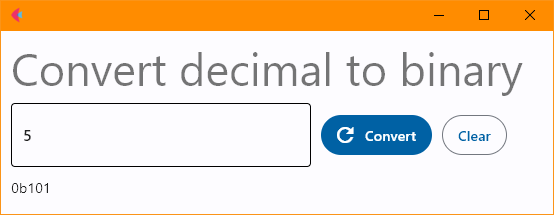
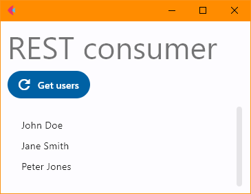

# Flet

[Flet](https://flet.dev/) is a framework created in 2022 to build GUI
applications in python using [Flutter](https://flutter.dev/). It aims at
creating multi-user web, desktop and mobile applications, although at the time
of writing (December 2022), it only works for web and desktop.

Install it with:

```bash
pip install flet
```

Screenshots:




