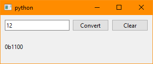

# Qt and Pyside classic

Qt is a library for cross-platform applications, not only for GUI but also for
other components. PyQt and PySide are two different Python bindings for Qt. Both
are implemented as Python modules and share a nearly identical API. The main
difference between them is the license: PyQt is released under GPL or a
commercial license, while PySide is released under LGPL. There's a [great
comparison here](https://www.pythonguis.com/faq/pyqt5-vs-pyside2/).

There's a graphical tool for creating interfaces called Qt Creator, which
generates `.ui` files that can then be loaded from Python.

There's another way of creating Qt applications: a declarative approach using
QML. There's another demo directory showing how that works.

The examples in this repository use PySide, as it is has been adopted as the
[official Qt bindings for Python](https://www.qt.io/qt-for-python). You can
install it like this:

```bash
pip install pyside6
```

Screenshots:





