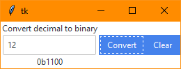

# ttkbootstrap

[ttkbootstrap](https://ttkbootstrap.readthedocs.io/) is a theme extension for
tkinter inspired by [Bootstrap](https://getbootstrap.com/).

Install ttkbootstrap with:

```
pip install ttkbootstrap
```

Screenshots:





